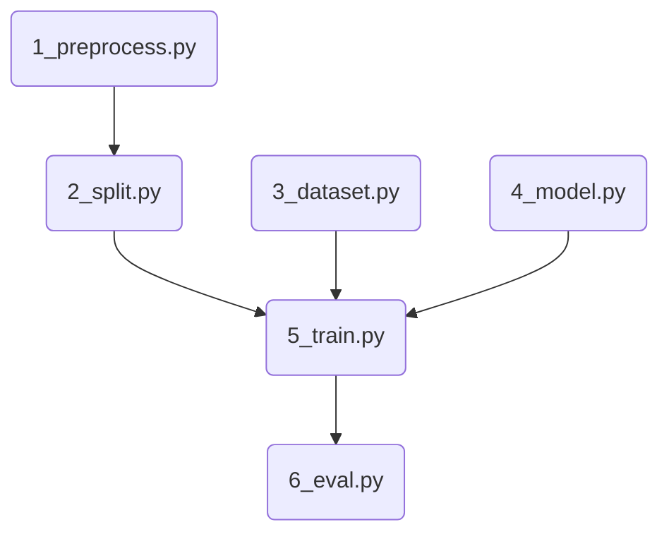

# Neural Network Training for Active Learning-augmented Intent-aware Obstacle Avoidance of Autonomous Surface Vehicles in High-traffic Waters Paper

This repository contains the code for our LSTM-backbone neural network training to predict the side a vessel will pass: left or right to your vessel. 

## Tested Environment & Dependencies
* Ubuntu 20.04
* Python 3.10

For a description of Python dependencies, please see the `pyproject.toml` file.

Dependencies are managed using [poetry](https://python-poetry.org/). You will need to install poetry, see these [instructions](https://python-poetry.org/docs/), we used `poetry==1.6.1`.

To run, clone this repository and then run from the passing_intention directory: 

## Usage Instructions
The overall relationship of the files in this directory can be seen below.



To run, please use the following commands from the root of this repository

```bash
poetry shell # create virtualenv
poetry install # install project dependencies
python 1_preprocessing.py # prepare data for training
python 2_split.py # create train/test split
python 5_train.py --parquet-path-train ./datasets/preprocessed_train_dataset.parquet --parquet-path-test ./datasets/preprocessed_test_dataset.parquet --learning-rate 1e-2 --num-workers 10 --is-training True --epochs 10000 --batch-size 20 # stopped at approx. 1000 epochs
python 6_eval.py # evaluate results
```
