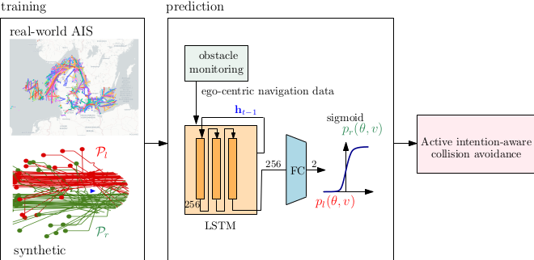
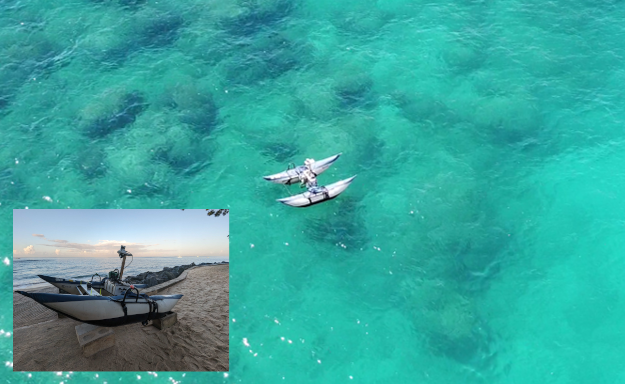
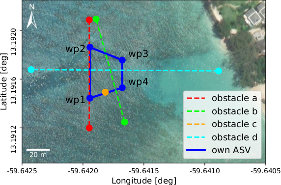
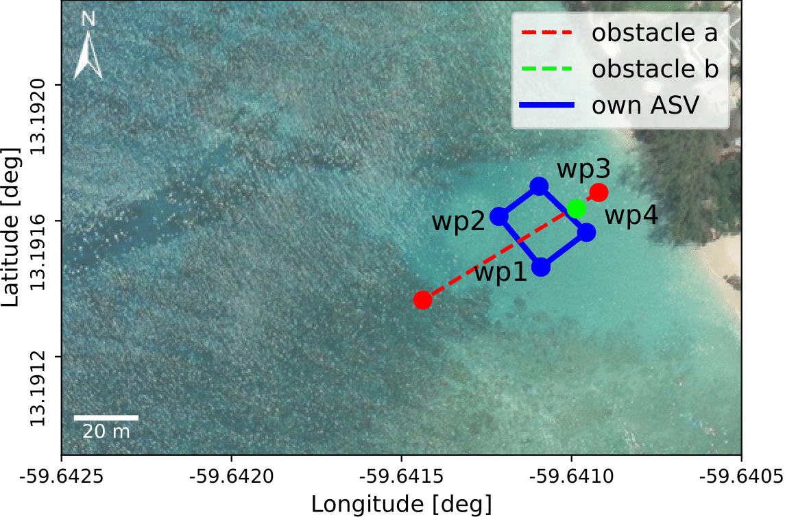
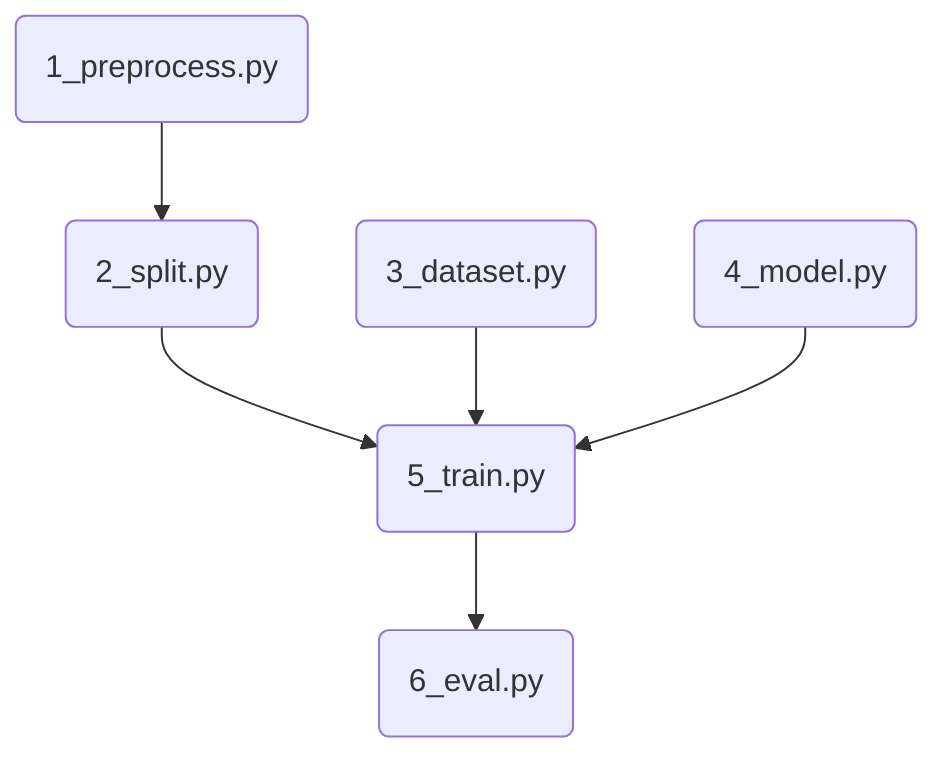
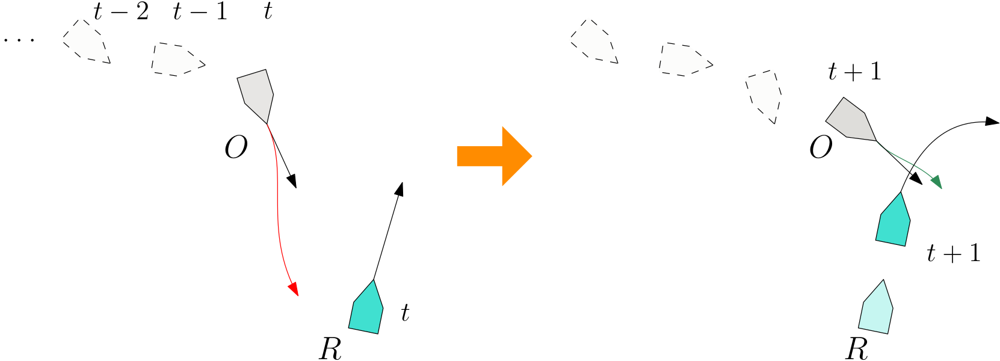
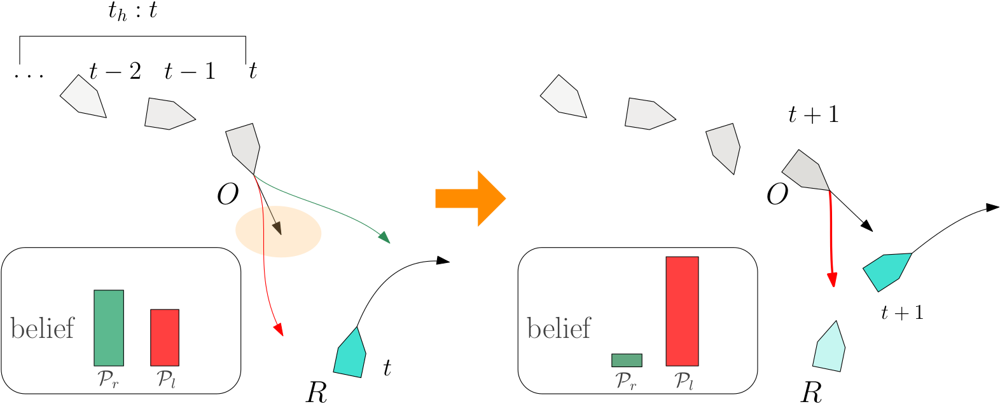

# Data, Data Generation and Neural Network Training for Active Learning-augmented Intent-aware Obstacle Avoidance of Autonomous Surface Vehicles in High-traffic Waters Paper


## Abstract
```
This paper addresses the obstacle avoidance of Autonomous Surface Vehicles (ASVs) for safe navigation in high-traffic waters while ensuring an active state estimation of obstacle's passing intent and reducing its uncertainty. We introduce a topological modeling of passing intent of obstacles, which can be applied to varying encounter situations based on the inherent embedding of topological concepts in COLREGs. With a Long Short-Term Memory (LSTM) neural network, we classify the passing intent of obstacles. Then, for determining the ASV maneuver, we propose a multi-objective optimization framework including information gain about the passing obstacle intent and safety. We validate the proposed approach under extensive Monte Carlo simulations 2,400 runs with a varying number of obstacles, dynamic properties, encounter situations, and different behavioral patterns of obstacles (cooperative, non-cooperative). We also present the results from a real marine accident case study as well as real-world experiments of a real ASV with environmental disturbances, showing successful collision avoidance with our strategy in real-time.
```

### Authors
* Mingi Jeong: mingi.jeong.gr@dartmouth.edu
* Ari Chadda: achadda@iqt.org
* Alberto Quattrini Li: aql@dartmouth.edu

### How to cite
```
@inproceedings{jeong-2024, author = {Jeong, Mingi and Li, Alberto Quattrini}, booktitle = {2024 IEEE/RSJ International Conference on Intelligent Robots and Systems (IROS)}, title = {Active Learning-augmented Intent-aware Obstacle Avoidance of Autonomous Surface Vehicles in High-traffic Waters}, year = {2024}, volume = {}, number = {}, pages = {}, doi = {}}
```

## General
<p align="center">
    
</p>

* This repository contains the code for our LSTM-backbone neural network training to predict the side a vessel will pass: topological modeling of left or right to your vessel as well as data and data generator including real-world AIS / synthetic traffic.
* Accepted to `IROS 2024` by Dartmouth Robotics (and non-archival presentation at `MOOS-DAWG'24`)


## Successfully Real-World Deployed on an ASV
<p align="center">
    
    <!--  -->


</p>

Real-world experiment with our custom ASV catabot in operation and experimental location with 4 obstacles, where the ASV successfully navigates this scenario using the proposed method.

## Tested Environment & Dependencies
* Ubuntu 20.04
* Python 3.10

For a description of Python dependencies, please see the `pyproject.toml` file.

Dependencies are managed using [poetry](https://python-poetry.org/). You will need to install poetry, see these [instructions](https://python-poetry.org/docs/), we used `poetry==1.6.1`.


## Folder structure
```
├── 1_preprocessing.py
├── 2_split.py
├── 3_dataset.py
├── 4_model.py
├── 5_train.py
├── 6_eval.py
├── aux_code
│   └── learning_preprocess.py
├── datasets
│   ├── extracted_data
│   ├── preprocessed_full_dataset.parquet
│   ├── preprocessed_test_dataset.parquet
|   ├── preprocessed_val_dataset.parquet
│   ├── preprocessed_train_dataset.parquet
│   └── synthetic_data
├── notebooks
│   ├── AIS_based_LSTM-preprocess.ipynb
│   └── AIS-synthetic-generator.ipynb
├── poetry.lock
├── pyproject.toml
├── README.md
└── weights
    └── model.pth

```

## Usage Instructions
To run, clone this repository and then run from the passing_intention directory:

### 1. Data Preprocess
In `notebooks`, you can run script to generate `.pkl` files for passing traffic ground truth data.
For real-world AIS, please see the following Danish Maritime [open source dataset](https://dma.dk/safety-at-sea/navigational-information/ais-data) and download `.csv` accordingly. 


### 2. LSTM Training 
The overall relationship of the files in this directory can be seen below.


```mermaid
flowchart TD
    preprocess(1_preprocess.py) --> split(2_split.py)
    split(2_split.py) --> train(5_train.py)
    dataset(3_dataset.py) --> train(5_train.py)
    model(4_model.py) --> train(5_train.py)
    train(5_train.py) --> eval(6_eval.py)
```

To run, please use the following commands from the root of this repository. You will need to replace `<HOME_ABSPATH>` with the absolute path to the directory for RayTune.

After running training (`5_train.py`), use the RayTune table to select the best trial. The model weight checkpoints will live in the `<HOME_ABSPATH>/ray_results` directory in the trial ID directory.

Then, replace the `MODEL_PATH` constant in the `6_eval.py` script and update the `TimeSeriesClassifier()` definition if appropriate. 

```bash
poetry shell # create virtualenv
poetry install # install project dependencies
python 1_preprocessing.py # prepare data for training
python 2_split.py # create train/test split
python 5_train.py --parquet-path-train <HOME_ABSPATH>/passing_intention_lstm_private/datasets/preprocessed_train_dataset.parquet --parquet-path-val <HOME_ABSPATH>/passing_intention_lstm_private/datasets/preprocessed_val_dataset.parquet --out-dir <HOME_ABSPATH>/passing_intention_lstm_private/passing_intention_model_training/run_2/ --is-training True --num-workers 4 --epochs 500
python 6_eval.py # evaluate results
```

## Overall Methodology

### Prior State of the Art
<p align="center">
    
</p>

### Proposed Method
<p align="center">
    
</p>

From time $t$ to $t+1$, controlled ASV, $R$'s collision avoidance behavior by state-of-the-art method vs.\ proposed method using active learning-augmented intent-awareness under an uncertain scenario where an obstacle, $O$ approaches from the left side of $R$: (**a**) At $t$, the state-of-the-art, lacking intent-awareness, predicts that O will pass on the left side (red) of $R$ and thus $R$ maintains its course as a *stand-on* vessel. At $t+1$, $R$ realizes $O$ is attempting to pass on the right side (green) of $R$, resulting in a nearmiss. $R$ did a hard turn-over but it is too late. (**b**) At $t$, our method classifies the topological passing side based on the historical data from $t_h$ to $t$ and actively determines an action to increase information gain, i.e., to decrease the probability of passing on the right side (green), which is risky due to bow crossing. This proactive action with *good seamanship* despite a *stand-on* status leads to a safe clearance at $t+1$.